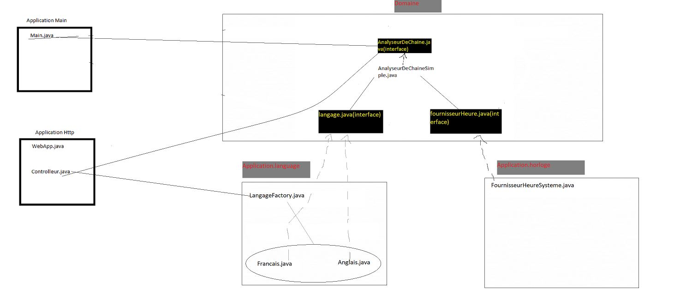

# Guide d'utilisation de l'application Maven/Spring Boot

## 1. Démarrage de l'application en mode console :
Pour démarrer l'application en mode console, exécutez la class Main.java.

## 2. Démarrage de l'application en mode web :
Pour démarrer l'application en mode web, exécutez la class TpArchitectureApplication.java.

### I) Partie web :
- Architecture de l'application :
  

- Test du contrôleur :
  Un fichier au format JSON pour tester le contrôleur est inclus. Il suffit de l'importer dans Postman après le démarrage de l'application web. Le header Accept-Language est inclus et accepte deux paramètres : "en" pour l'anglais et "fr" pour le français.

### II) Partie console :
Toutes les classes nécessaires sont initialisées dans la méthode main qui se trouve dans la classe Main. Ainsi, c'est le client qui décide des classes qu'il veut utiliser pour l'exécution du programme. Dans ce cas, la dépendance "language" qui a deux implémentations : français et anglais.
